# ✈️ Aero Airways

**Aero Airways** is a modern, cross-platform mobile application built to simplify the flight experience — from searching flights to tracking real-time locations, all while offering secure authentication and beautiful, responsive design.

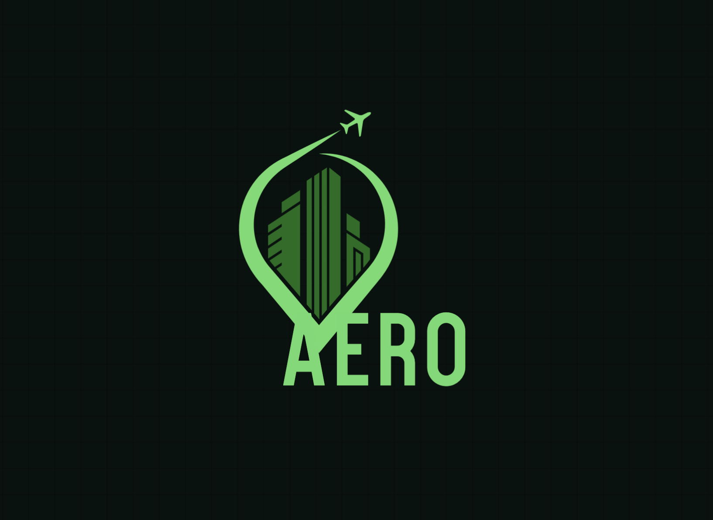

---

## 🚀 Project Goals

- Help users easily find, track, and manage flights.
- Provide secure and smooth authentication using Google and Firebase.
- Deliver real-time location and mapping features.
- Build a clean, modern UI with responsive and animated components.
- Ensure scalable architecture with Riverpod and RESTful APIs.

---

## ✨ Features

- **Google Sign-In**: One-tap authentication using Firebase.
- **Firebase Integration**: Real-time data, authentication, and Firestore storage.
- **CRUD Functionalities**: Manage user profiles, saved flights, and history.
- **Flight API Integration**: Fetch and display real-time flight details.
- **Flight Search & Lookup**: Search by destination, airline, or flight number.
- **Location & Maps**: Collect and display the user's current location using Google Maps.
- **Theme Mode**: Switch between dark and light themes seamlessly.
- **Smooth Animations**: UI transitions and effects built with animation libraries.
- **Test Coverage**: Uses Mockito for mocking and testing service logic.

---

## 🛠️ Tech Stack

- **Flutter** – Cross-platform development for iOS and Android.
- **Firebase** – Authentication, Firestore, Storage.
- **Google Maps** – Maps, location services.
- **Riverpod** – Scalable and testable state management.
- **AviationStack REST APIs** – For real-time flight data and server communication.
- **Hive** – Lightweight local storage for caching and offline support.
- **Mockito** – Unit testing and API mocking.
- **Modern UI** – Tailored UI with custom components, dark mode, and motion effects.

---

## 📦 Installation

1. Clone this repo
2. Run `flutter pub get`
3. Set up your `.env` file with Firebase & API keys
4. Run on device:
```bash
   flutter run
```

 ## Aero APP FLOW AND SCREEN DETAILS
| 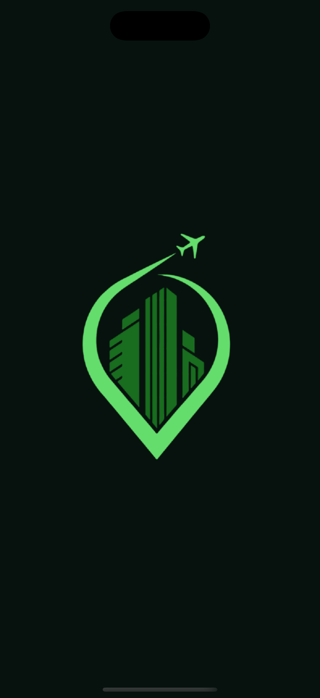 | 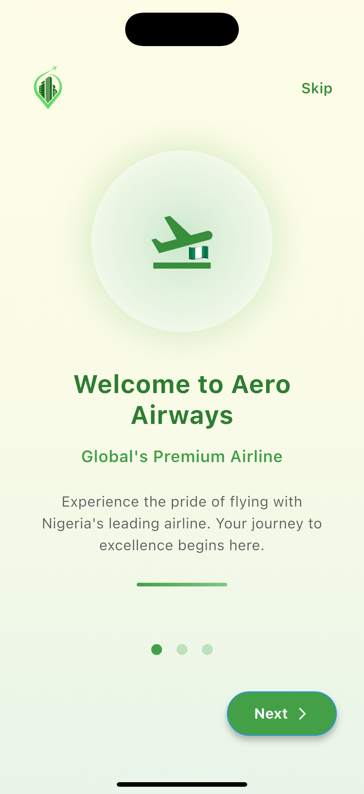 |  | 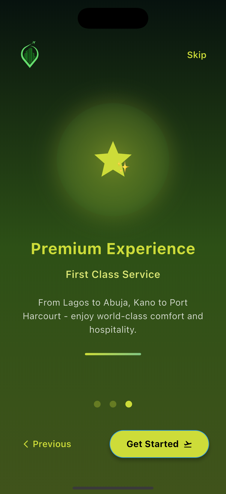 | 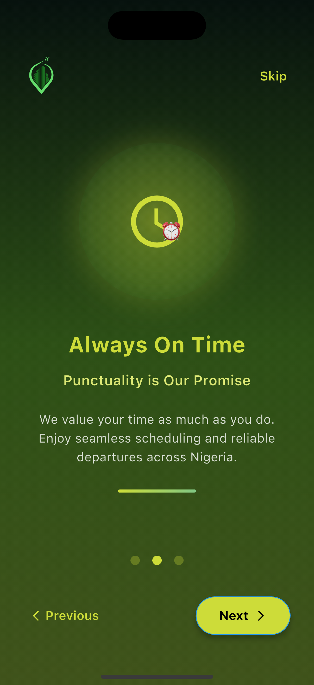 |
|-------------------------------------|-------------------------------------|-------------------------------------|-------------------------------------|-------------------------------------|
| 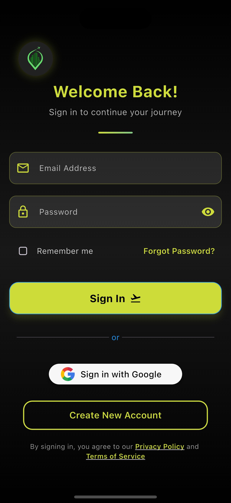 | 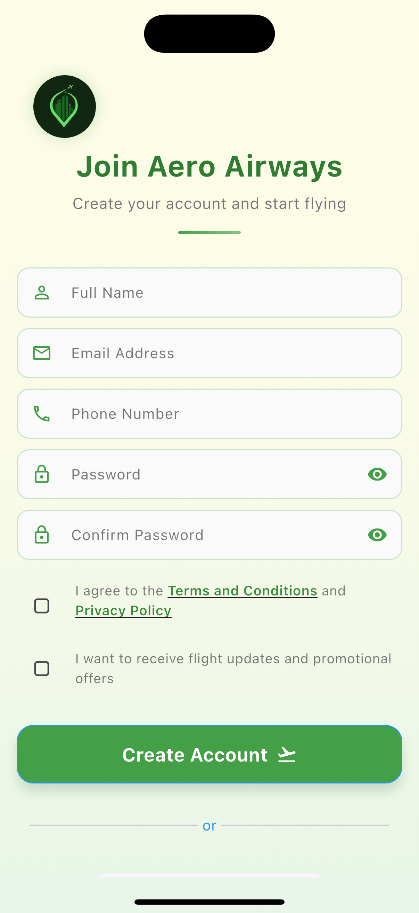 | 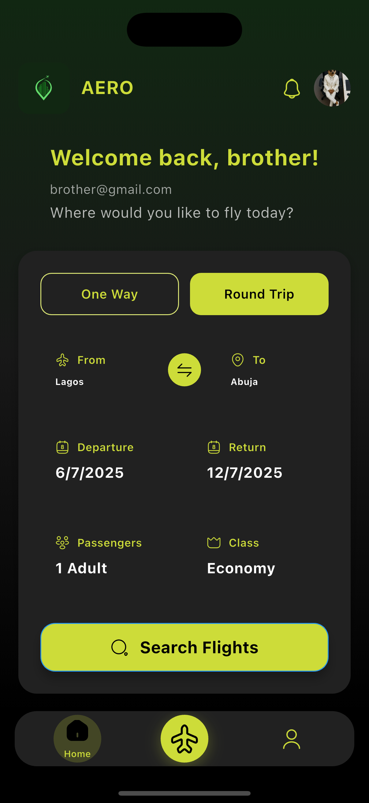 | 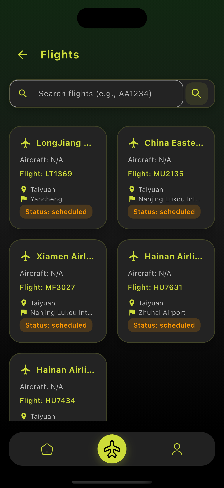 | 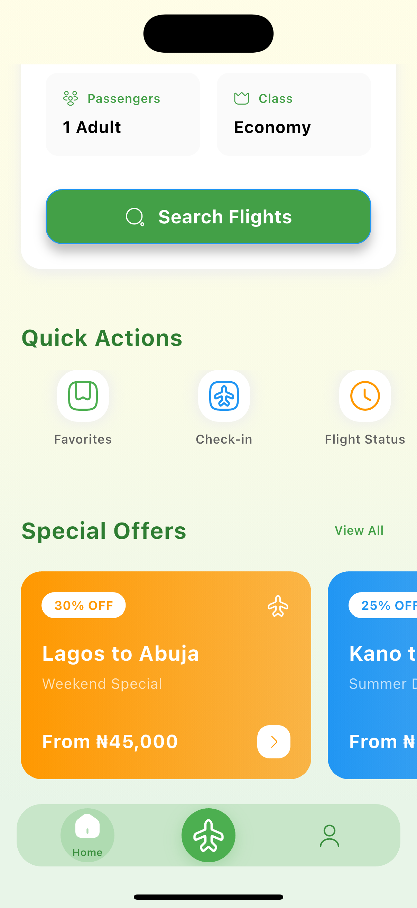 |
| 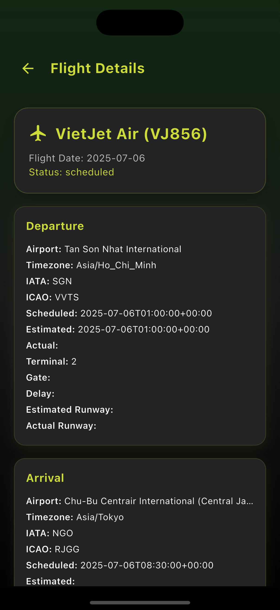 | 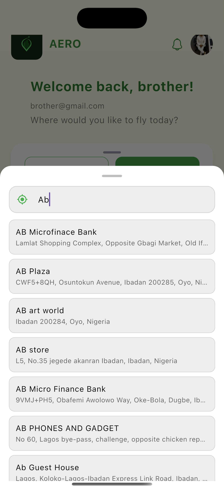 | 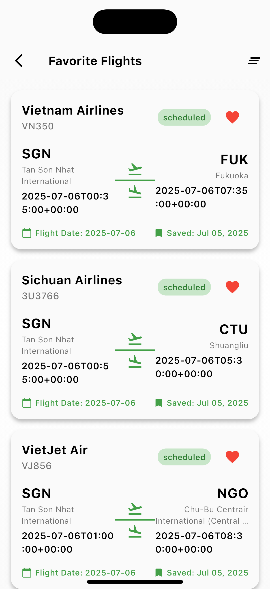 | 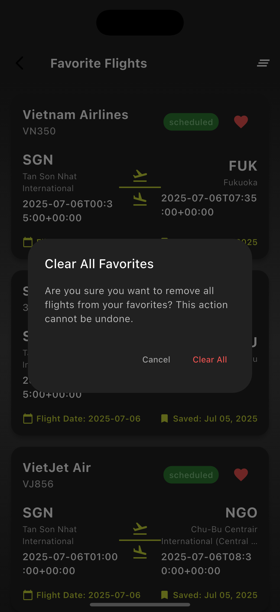 | 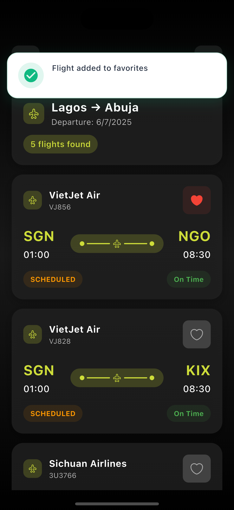 |